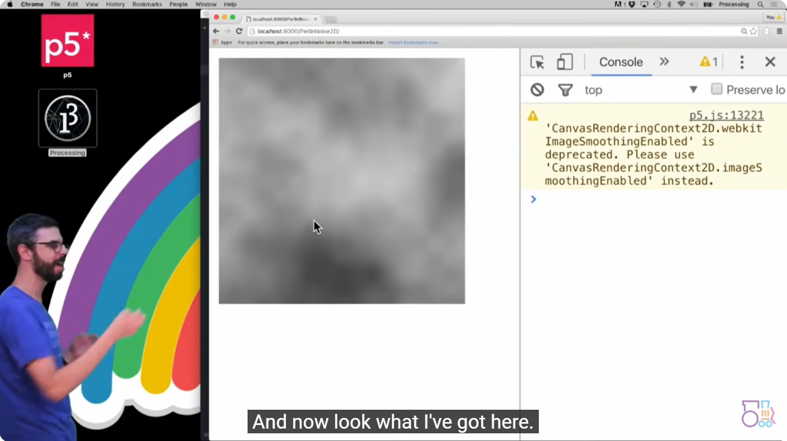
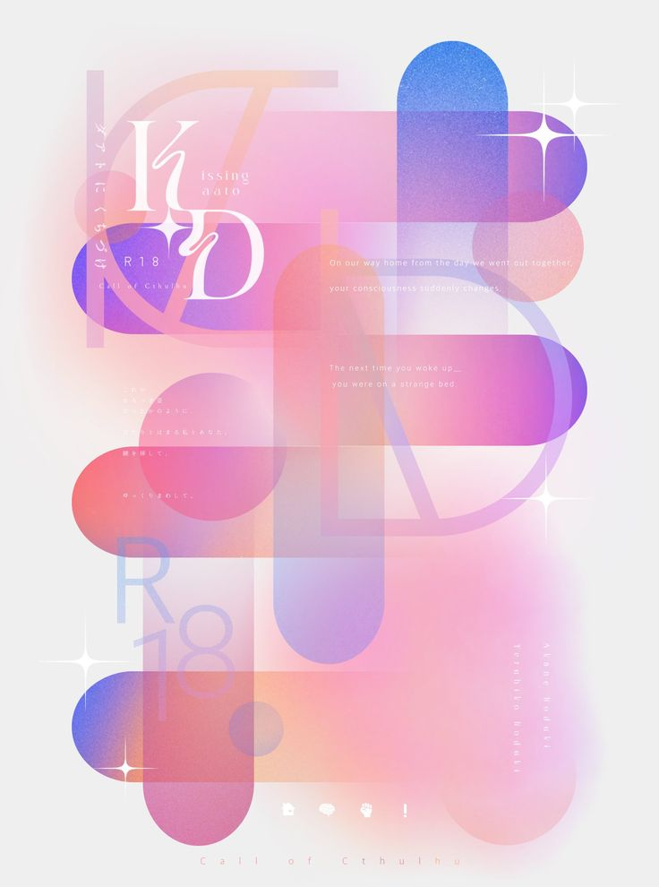
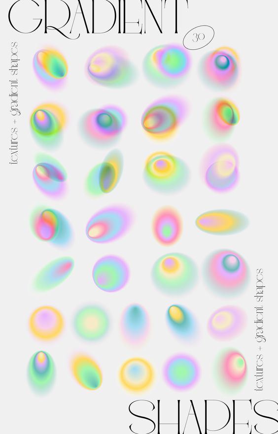

# **Creative coding major project-yuli0518**

## **Interactive Instructions**
When you move the mouse on the canvas, the background noise effect will change accordingly.

## **Details**
- I chose to use perlin noise to change the base code.
  
- In the image, the background changes interactively, and in the rest I change the colors to make the whole picture more unified.
  
## **Source of Inspiration**
[Link to the coding train](https://www.youtube.com/watch?v=ikwNrFvnL3g)

- I referred to the explanation of perlin noise in one of the Coding Train issues, selected one of the marble pattern effects, and made some changes.

[Link to art works1](https://kr.pinterest.com/pin/70437487706732/)

[Link to art works2](https://kr.pinterest.com/pin/1477812372727650/)

[Link to art works3](https://kr.pinterest.com/pin/6333255722678130/)


- In terms of style, in order to match the changing marble patterns, I referenced the dopamine-style works of some artists while color mixing.

## **Technical Description**

- In the code, I used functions such as noise Value to make the marbled part.
- I asked Chatgpt in the section on how to connect mouse movement and noise.
```
function mouseMoved() {
  // Dynamic adjustment of Perlin noise factor according to mouse position
  let xoff = map(mouseX, 0, width, 0, 1);
  let yoff = map(mouseY, 0, height, 0, 1);
  let mouseNoise = noise(xoff, yoff);
  noiseFactor = map(mouseNoise, 0, 1, 0.05, 0.2);

  // Redrawing the canvas
  redraw();
}
```
- In the basic code, in order to avoid confusion and errors, I use these three functions: **function draw()**, **function drawRects()**, and **function drawCirclesandLines()** to separate elements and change the basic color composition.